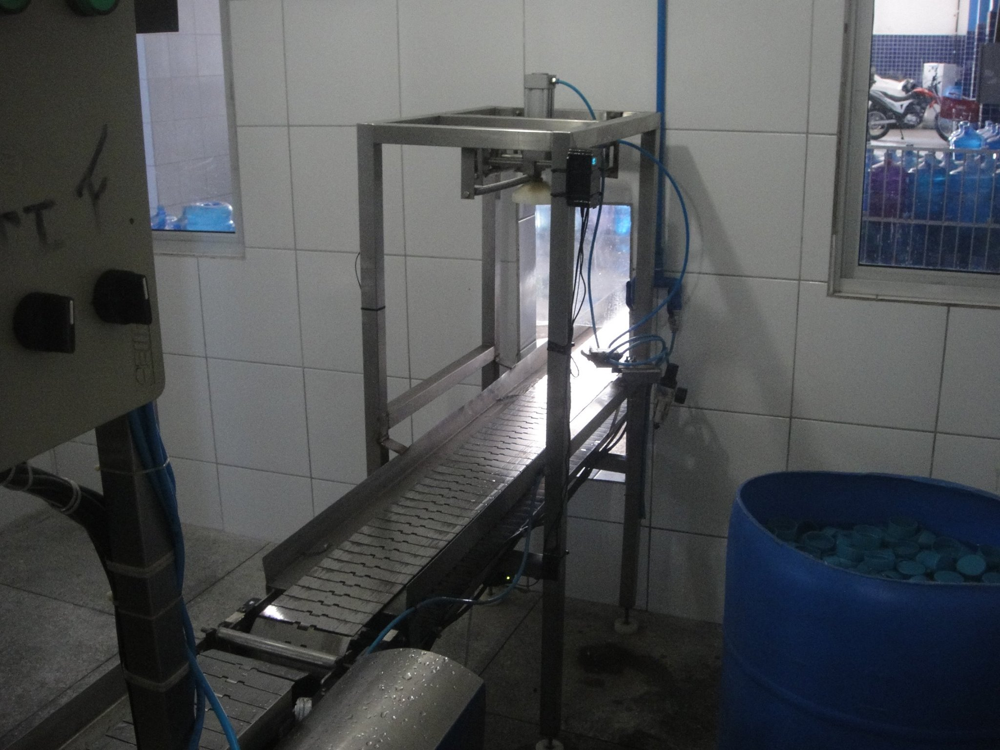
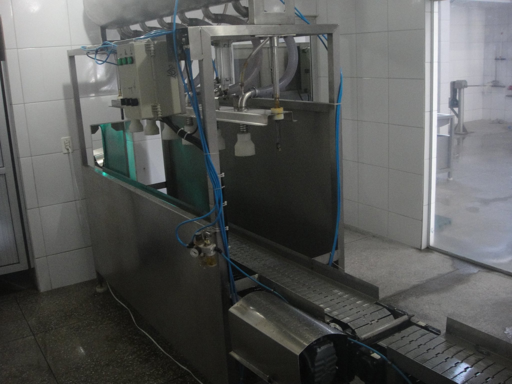
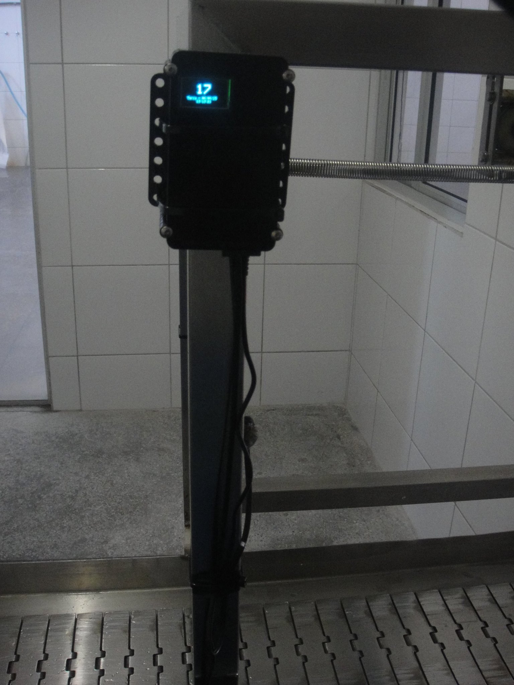
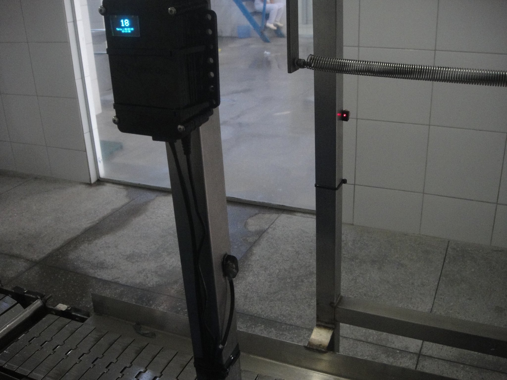
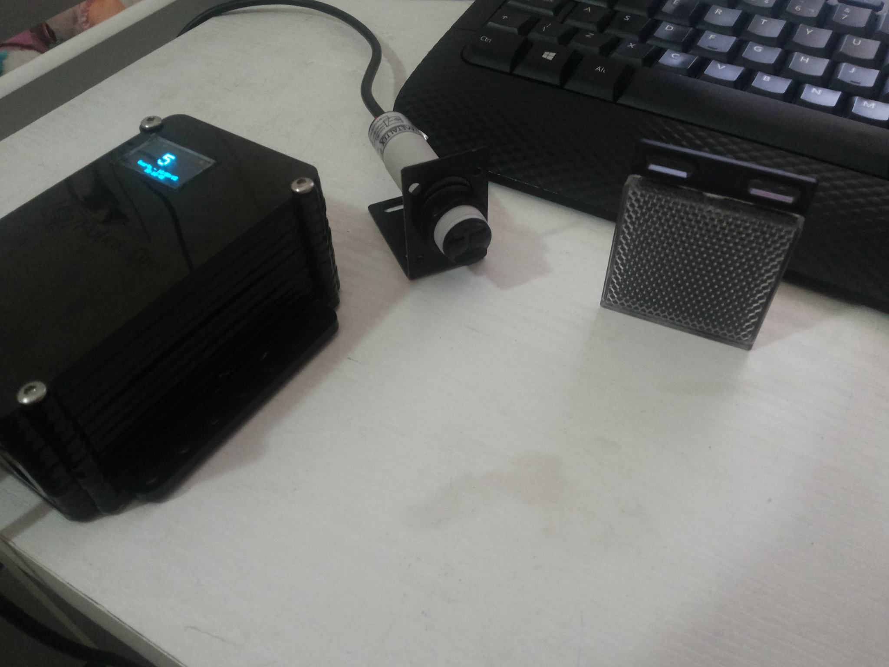

<!-- Headings --> <!-- Strong --> <!-- Italics --> <!-- Blockquote --> <!-- Links --> <!-- UL --> <!-- OL --> <!-- Images --> <!-- Code Blocks --> <!-- Tables --> 
<!-- Task Lists -->

# Abaco_SE (Counter Machine)
> ### Product counter with OLED display hight bright and easy to get to know. For any propose.

> ### Features
1. Does not lose count if power is lost
1. Uses high performance microcontroller
1. It even counts with translucent water bottles
1. Speed of up to 3 products per second
1. Dynamic Event Compensator (CES) avoids double counting on irregular objects
1. Number of digits automatically configured by the system 
1. Internal clock shown on the display
1. Easy to read in any quality and environment
1. Automatically resets the count the next day
1. Works without user intervention

> ### Hardwares
1. Atmega328
1. Card Reader
1. Ethernet Socket
1. Oled display 0.63' Blue
1. Black Piano Acrilic Case
1. Serial Data Link

> ### Protoypes Videos
**Click on the text below to watch on Youtube Channel**

* [Abaco SE](https://www.youtube.com/watch?v=K9LMvtEWeMo&list=PL4vok-JSscqD_f4F9JEucI_fXp49GaD4L&index=13) 

> ### Protoypes Images

> ### Contact

> **Atention** If you go email me, please put as subject the name of the project, in this case: **(Abaco_SE) Requests**

|  Name |  Email | Mobile  |
|-------|--------|---------|
|  Yuri Lima | y.m.lima19@gmail.com  | +353 83 419.1605  |
